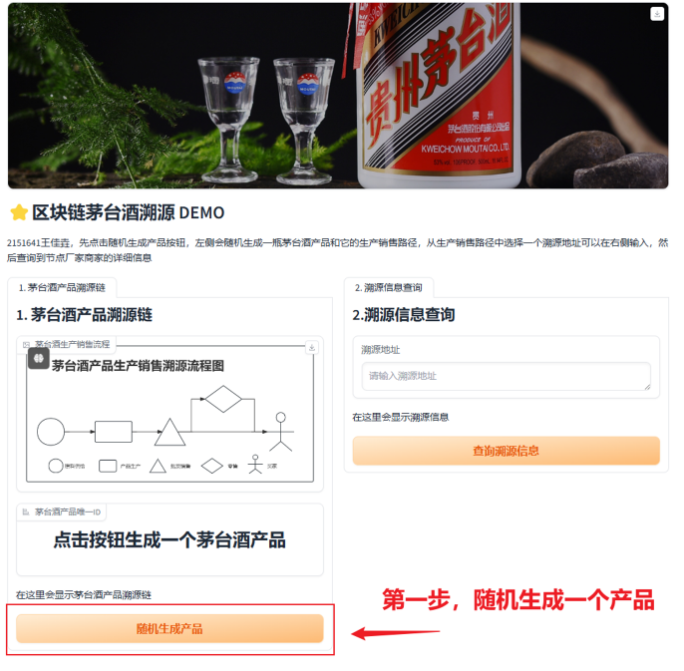
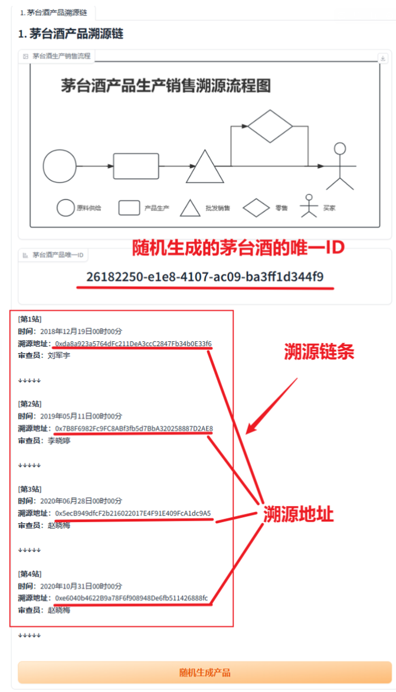
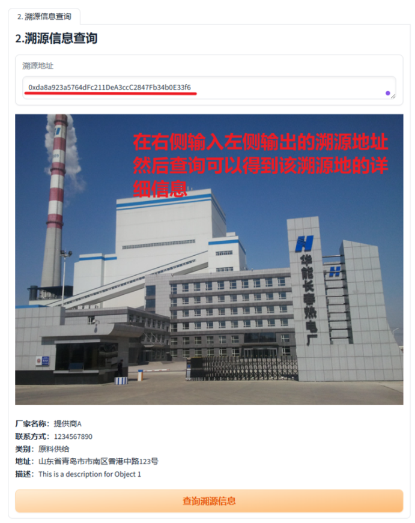

本DEMO为同济大学2024春季学习信息安全基础课程课程设计2：区块链设计

要求采用区块链技术开发一个小型的Demo系统，可以茅台酒溯源

作业要求&笔记，实现思路：https://momoyamasawa.notion.site/cb75e684a803490a85217c6262e76a4b?pvs=4

# 0. 功能展示

**注意**：后端写了2个原料供给节点，3个产品生产节点，2个批发销售节点，5个零售节点，随机的茅台酒产品会在上面的节点按阶段顺序每个阶段随机选择一个节点信息生成溯源链条（其中可能会没有零售阶段，即买家直接从批发销售得到产品）

# 1. 运行说明

1. 先下载 requestment.txt 里的 python 库
2. 下载 Ganache 区块链以太坊本地模拟软件，启动测试区块链以太坊网络并且设置 account 个数为 20，开启端口应为本地的 7574（默认）

3. 直接 python 运行 frontend.py

# 2. 文件结构

backend.py 是后端

frontend.py 是前端

Traceability.sol 是智能合约，bin 后缀的是它编译出来的二进制内容，abi 后缀是编译出来的二进制接口内容

